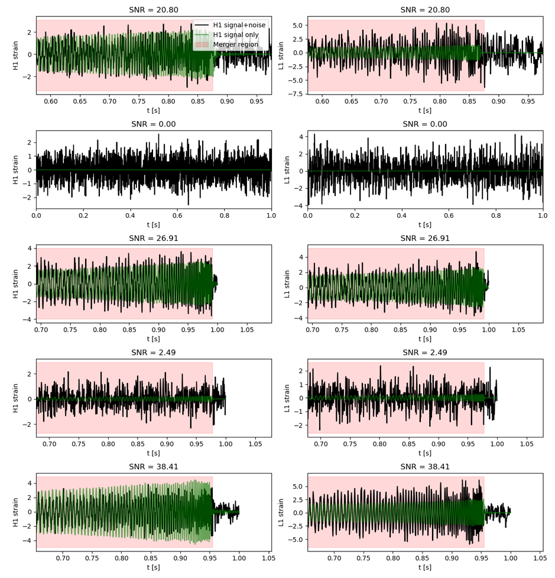
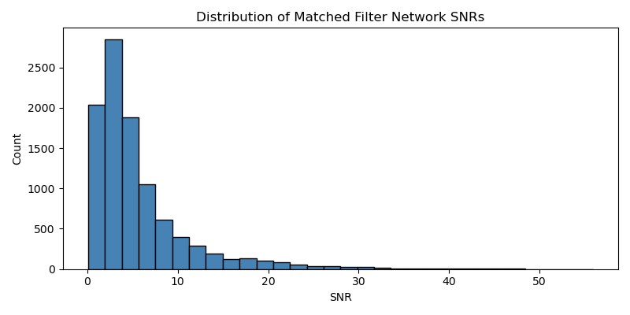
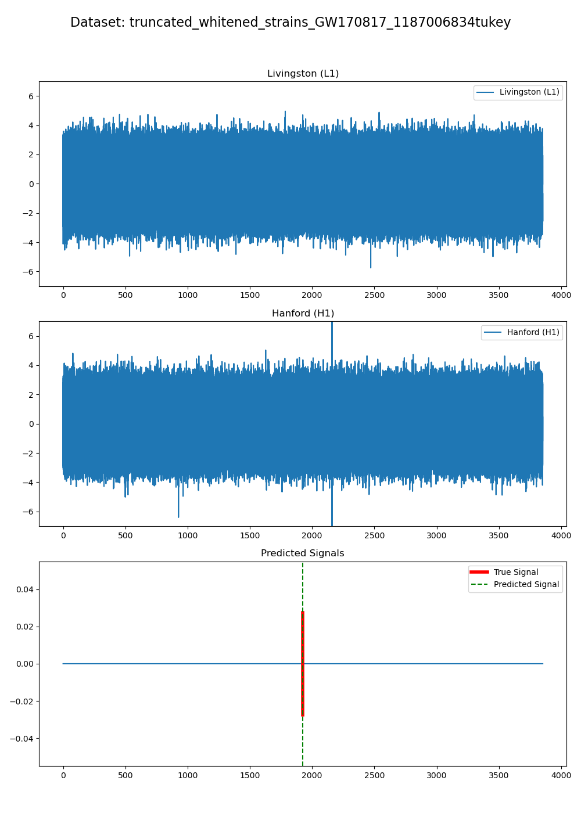

# Wavenet Torch Implementation for Gravitational Wave Classification

---

## 0  Introduction  
This repository contains a **PyTorch / Lightning** re-implementation of the WaveNet-style classifier from *arXiv:2306.15728*, tailored for real LIGO data.  
Key goals:

* **End-to-end training** on synthetic waveforms injected into true interferometer noise.  
* Two interchangeable back-ends for multi-detector aggregation:  
  **CNN + PinSage_Attn** (default, attention-weighted) and **CNN + PinSage** (graph-pooled).  
* A **modern curriculum**: the new data-loader starts with louder injections, then *decays* toward the realistic SNR distribution for smoother convergence.  
* Scripts for multi-GPU training, validation, and inference on unseen events.


### Installation and Usage
To get started with this project, clone the repository and install the required dependencies:
```
git clone https://github.com/victoria-tiki/Wavenet_torch.git
cd Wavenet_torch
```
This project includes slurm scripts for use in high-performance computing environments. To train the model, execute:
```
sbatch slurm_train.sh
```

The remainder of the README explains how the data are generated, which hyper-parameters matter most, and how to tweak them without falling into the data-leakage trap.

---

## 1  Model Variants
| Name | Components | When to use |
|------|------------|-------------|
| **CNN + PinSage_Attn** (default) | 2-channel CNN front-end (processing Livingston and Hanford signals separately) → PinSage **attention-based** aggregator | Best overall; lets the network weight L1 vs H1 features dynamically, empirically found to reduce FPs|
| **CNN + PinSage** | 2-channel CNN front-end → PinSage **graph** aggregator | For ablation or if you prefer deterministic pooling. |

---

## 2  Training Pipeline 

## 2.1 Overview
We start with a library of **synthetic binary-merger waveforms** and a stash of **real LIGO noise**.  
During training the *data generator*:

1. Picks a waveform (or none, for noise-only cases). For legacy dataloader the signal is whitened here  
2. Picks a noise chunk.  
3. Injects / mixes them at a chosen SNR
4. For new dataloader whitens and band-passes the signal+noise here
5. Windows the result.  

The resulting `[4096 × 2]` tensor (H1 & L1) and a binary target mask are fed to the model through a PyTorch `DataLoader`.
For each 4 096-sample window the target mask is **1** during the `dim` samples immediately *before* the merger (you can change that span via `dim` and `segment_length`) and **0** everywhere else—including pure-noise windows.  
The network outputs a per-time-step confidence score in **[0, 1]** that is trained to match this mask.

<p align="center">
  
</p>
<sup>Figure 1 – Five random training windows (H1 &amp; L1) with merger region highlighted. Shows 3 boosted signals, low SNR original signal, pure noise segment </sup>

## 2.2  Data-Generation Modes
Two dataloaders are presented. Their behavious differs in the following ways:

|                     | **`data_generation` (NEW)** | **`data_generation_old` (LEGACY)** |
|---------------------|-----------------------------|------------------------------------|
| **Noise on disk**   | Raw, **un-whitened**. | Already **whitened**. |
| **SNR definition**  | Matched-filter SNR. | Custom “training SNR” defined via relative time-domain std. |
| **Curriculum**      | Probabilistic boost of chosen SNR range (eg. ∈ [15, 40]) that **decays** over time into realistic distribution. | User provides an explicit per-epoch schedule. |
| **Key args**        | `p_higher_init`, `p_higher_fin`, `boosted_range`, `decay_epochs`, `bandpass`, `noise_prob` | `snr_schedule`, `snr_bins`, `noise_prob` in snr_scheduler|
| **Why keep it?**    | Physics-aligned SNRs, smoother training, fewer knobs. | Exact reproducibility of older experiments, fine-grained control. |
| **Band-pass filtering**   | Built-in Butterworth (default **10–1000 Hz**) applied **after** whitening to remove artifacts. 10-1000 Hz keeps it closer to LIGO processing| Assumes data are already whitened & filtered; no extra band-pass inside the loader |
---

## 3  Hyper-parameter Guide – “What to tweak & why”

### 3.0  How the two data-loaders handle SNR

* **`data_generation` (NEW)**  
  *Uses raw (un-whitened) noise.*  
  During training it **boosts** injections with SNR in a configurable range (default **15 – 40**).  
  The boost probability starts at `p_higher_init`, decays exponentially, and bottoms out at `p_higher_fin` after `decay_epochs`.

* **`data_generation_old` (LEGACY)**  
  *Uses pre-whitened noise.*  
  No built-in boost. Instead you pass an **external `snr_schedule`** that specifies the target SNR for each epoch.  
  Because SNR varies abruptly between bins, you often have to co-tune the LR schedule. This does allow for fine grained control since
  we're not relying on the realistic matched filter-distribution but introduces several hyperparameters (3 for each bin) 

<p align="center">
  
</p>
<sup>Figure 2 - Example SNR histogram without boost. Most of the set is hard to learn (ultra-low snr) </sup>


### 3.1  Quick knobs (first things to try)

| Parameter | Default | Loader | Where to change | Why / when to change |
|-----------|---------|--------|-----------------|----------------------|
| `noise_prob` | **0.65** | both | `GWDataset` arg | ↑ to cut false-positives; ↓ to cut false-negatives. Sweet-spot 0.60 – 0.70. |
| `p_higher_init` | **0.50** | NEW | `GWDataset` arg | Raise if early epochs miss *loud* events. |
| `p_higher_fin`  | **0.05** | NEW | `GWDataset` arg | Raise if the *final* model still misses loud events. |
| `patience` (ReduceLR) | **3** | both | `LightningModel.configure_optimizers` | Tweak if LR drops too early / too late. |
| `snr_bins` / `bin_size` | project-specific | LEGACY | build your `snr_schedule` | Finer bins = more control but tighter LR coupling. |

> **Tip:** set `plot_samples=True` in `GWDataset` to save 5 example windows and visually verify any change (see figure 1)


### 3.2  Other knobs (tune after the quick ones)

| Parameter | Default | Loader | Where to change | Why / when to change |
|-----------|---------|--------|-----------------|----------------------|
| `decay_epochs` | **10** | NEW | `GWDataset` arg | Lengthen if training is unstable; shorten if convergence is slow. |
| `boosted_range` | **[15, 40]** | NEW | inside `__data_generation` | Shift / widen around the SNRs that matter for your search; keep it broad enough to avoid data leakage. |
| `reset_epoch` | **9999** (≫ epochs) | both | callback `CustomLRSchedulerCallback` | High value = disable reset (**recommended start**). Set ≈`decay_epochs` to kick LR once the boost ends. |
| `new_lr` | `5e-4` | both | same callback | < initial LR → conservative late training; ≥ initial LR → aggressive fine-tuning on hard samples. |
| `bandpass` | 10 – 1000 Hz | both | butter filter in `GWDataset` | Advanced: tighten to 20 – 800 Hz to test robustness vs. PSD mismatch. |


### 3.3  SNR boost formula (NEW loader, for reference)

```python
# GWDataset.__init__
tau = -decay_epochs / np.log(p_higher_fin / p_higher_init)
p_higher(epoch) = p_higher_init * exp(-epoch / tau)
```

τ is **derived**; you only set `p_higher_*` and `decay_epochs`.

### 3.4 Training workflow suggestion
1. **Start** with loader defaults and a *very high* `reset_epoch` (essentially disabling LR-reset).  
2. Tweak the **Quick knobs** until the **validation statistics**  looks reasonable (don't rely too much on the loss alone)
3. Adjust the **Other knobs** one at a time.

Feel free to experiment as you get a better feel for the behaviour of the network.  

> **Validation vs Test**  
> • Tune every hyper-parameter **only on the validation set** (eg synthetic signals + real noise).  
> • Once satisfied, evaluate once on the **held-out test set** (eg true events) to avoid data leakage.  
> • Make sure the PSD and noise statistics used in validation **match** those expected for the test data; mismatched noise can hide generalisation issues.

Happy tuning!


## 4. Inference Guide for true signals

Run the provided notebook to run inference on true LIGO signals. The following text refers to the behaviour of utils.py. utils_LEGACY.py uses different offsets and other parameters (kept to reproduce older behaviour).  

### 4.1  How it works — quick tour
1. **Slice the strain:**  
   Each detector’s whitened strain is chopped into **4 096-sample windows** (≈ 1 s) at a set of *offsets* (0 s, 0.25 s, 0.50 s, 0.75 s by default).  

2. **Model prediction:**  
   The network outputs a score ∈ [0, 1] for *every time-step* in each window.  
   > These scores **approximate** a probability of GW presence, but because the model isn’t explicitly calibrated the values should be treated as *confidence* rather than a mathematically exact probability.

3. **Peak finding:**  
   We run `scipy.signal.find_peaks` on the 1-D score series. A detection is kept only when  
   * the peak height ≥ **`threshold`**  
   * the peak full width at half-prominence (FWHM) ≥ **`width`** samples  
   * **at least 50 %** of the samples inside that width remain above `dynamic_mean`  
     (`dynamic_mean = max(0, min(0.95, threshold – 0.05))` and `if (np.mean(sliced > mean) > 0.5):` by default).  
   > *Misconception:* “Any single sample over threshold is enough.”  or "A trigger is returned if a signal is above `threshold` for `width` samples"
   > In reality **all three** conditions (height, width, mean) must pass.

4. **Merge duplicates:**  
   Peaks within **0.25 s** of each other (from overlapping windows) are merged into a single trigger time.

5. **(Optional) multi-model AND gate:**  
   If you run several checkpoints, you can keep only triggers that appear in *all* models within **`tolerance`** seconds (AND gate aggregation)

### 4.2  Main knobs

| Parameter | Default | Effect | When to change |
|------|---------|--------|----------------|
| `threshold` | 0.90 | Min peak height; most influential on FP vs FN. | Lower if you miss obvious signals; raise if FP sky-rockets. |
| `width` | 1 000 samples (≈ 0.24 s) | With `dynamic_mean` + 50 % rule, ensures the peak is **sustained** (FWHM ≥ `width`) rather than a narrow glitch | Increase to suppress short glitches; decrease for very brief signals |

Keep these two consistent **per model checkpoint set** and **per strain set** once chosen; changing them mid-analysis invalidates validation metrics.

### 4.3  Secondary knobs (touch sparingly)

| Parameter | Default | Location | Why / when to touch |
|------|---------|----------|---------------------|
| `offsets` | `[0, 1023, 2047, 3070]` | `utils.make_preds` | Fewer ⇒ faster but risk missing TPs; more ⇒ slower but safer. |
| `dynamic_mean` | `threshold – 0.05` (clamped to [0, 0.95]) | `find_peaks` wrapper | Raise if narrow peaks are still sneaking through. |
| `tolerance` | **0.05 s** | `process_triggers` | How close triggers from different models must be to count as the same event. |
| Butterworth band-pass | *commented out* | `butter_bandpass_filter` | Usually unnecessary (GWOSC data are already filtered). Uncomment to mimic training filter. |
| Mean-fraction test | `np.mean(slice > mean) > 0.5` | `find_peaks` | Increase (e.g. 0.75) to demand flatter plateau; drop (e.g. 0.3) if you miss wide, low peaks. |

### 4.4  Interpreting triggers
* **Output format:** `{'detection': [t₁, t₂, …]}` where times are in **seconds since file start** (`gps` is in the filename for our project).  
* For most example strains we provide, a true signal is either centred in the file (here ≈ 1 925 s) **or** the file is pure noise.  
  Check the gps time provided in the strain filename or ask the data-prep author.

<p align="center">

</p>
<sup>Figure 3 – Strains and final trigger (green) for GW170817 (before noise removal strain, tukey window applied to large glitch).</sup>

### 4.5  Good practice
* **Validate first, test last.** Tune `threshold` & `width` on a validation set of *synthetic + noise* segments, **not** on the true-event test files.  
* **Consistent settings.** Use the same peak-finding parameters for all checkpoints you compare.  
* **One change at a time.** Adjust `threshold` → re-plot ROC, then maybe tweak `width`, etc.—avoids chasing moving targets.

---

### 5. Data

<sup>*Large data files required for training and inference are not stored in-repo; download or generate locally.*</sup>

| What you need | Where to get it | Notes |
|---------------|-----------------|-------|
| **Synthetic waveforms** | e.g. `NRHybSur3dq8`, `IMRPhenomXPHM`, or your own surrogate bank | Cover the same mass / spin range you expect at inference time. |
| **Noise-only strains** | Fetch from GWOSC with `gwpy` (see short code snippet below). whitened noise for legacy dataloader, raw noise for new dataloader| Choose GPS segments from the same LIGO observing run (O2, O3, O4, …) and verify they are event-free. |
| **Real signals for testing** | GWOSC event files (`.hdf5`) before noise substraction (depending on noise used for training) or internally curated injections | Keep completely held-out for final evaluation to avoid data leakage. |

```python
from gwpy.timeseries import TimeSeries

# Fetch noise-only strain data from LIGO open data (e.g., O3 run)
gps = 1242442967      # replace with noise-only start time
dur = 14745600        # duration in seconds, here: hour long
fs  = 4096            # sample rate in Hz

strain_L1 = TimeSeries.fetch_open_data('L1', gps, gps + dur, sample_rate=fs)
strain_H1 = TimeSeries.fetch_open_data('H1', gps, gps + dur, sample_rate=fs)

```

---

### 6. Checkpoints

Checkpoints trained for BBH (validated on month long February 2020 LIGO data) and BNS detection (validated on hour long August 2017 LIGO data) can be found under /checkpoints. For now, these have only been validated on a small dataset, so should only be used for further testing or proof-of-concept. 


